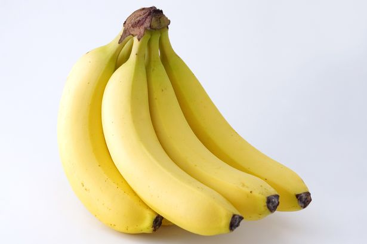
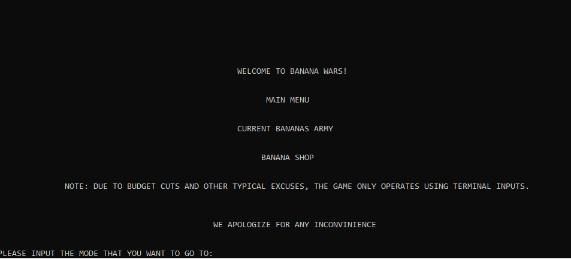
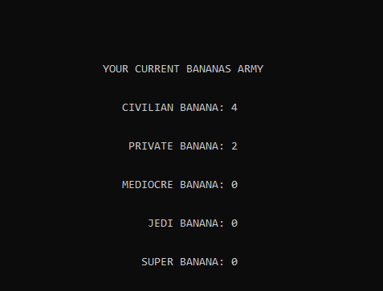
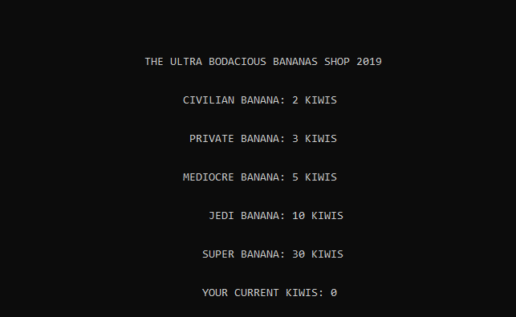
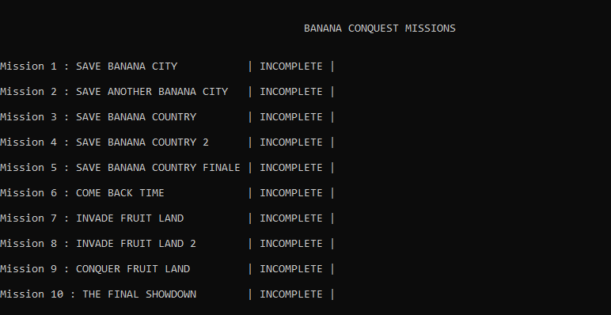
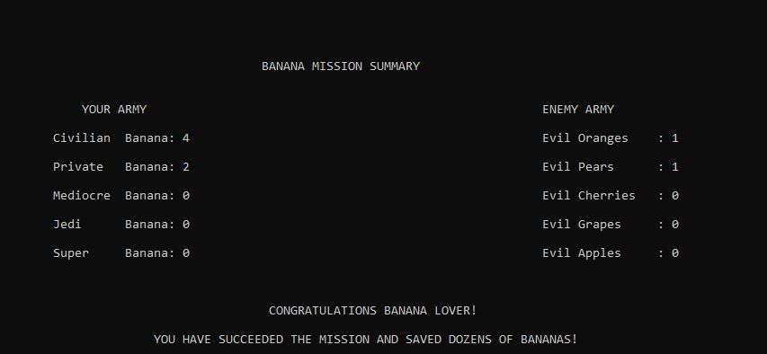

# Banana-Wars
Terminal Simulation Game.

**THE STORY**

The Bananas are getting attacked by some of the most heinous and evil fruits. It is your job to strategically lead the elite bananas and fight back against evil.

This is the intro screen of the game. You can access any mode via command input at the bottom. 

This is the current army that you have. These are some of the most elite bananas in the world.

This is the shop where you can purchase more elite banana soldiers. The currency is kiwi because kiwi is a cool fruit.

These are all of the available missions in the current game. The last mission is proved to be difficult because there is a lot of RNG involved.

This is the mission summary after every attempt. It details how many enemies there are and the current status of your banana army.

